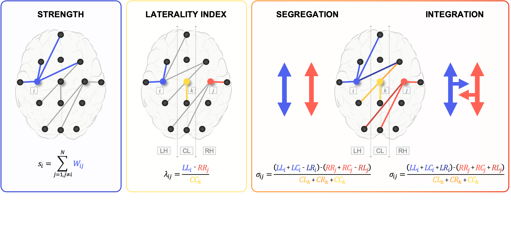
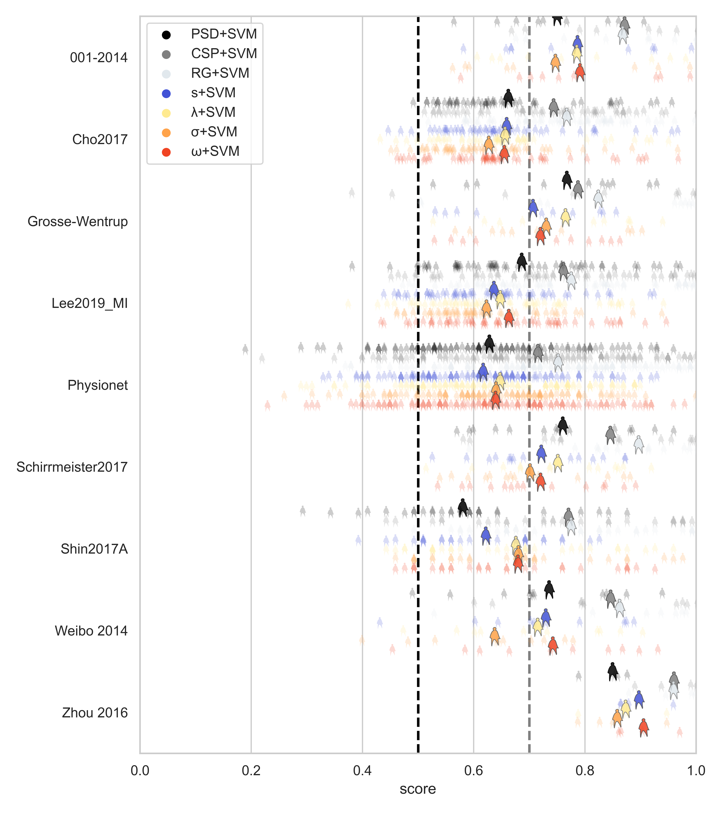

#netfeat
---
This repository contains the code and supporting documents associated with the following manuscript:

J. Gonzalez-Astudillo and F. De Vico Fallani. (2024) "Feature interpretability in BCIs: exploring the role of network lateralization." [arXiv:2407.11617](https://arxiv.org/abs/2407.11617)

---
## Authors:
* Juliana Gonzalez-Astudillo, Postdoctoral Researcher, NERV team-project, Inria Paris, Paris Brain Institute
* [Fabrizio De Vico Fallani](https://sites.google.com/site/devicofallanifabrizio/), Research Scientist, NERV team-project, Inria Paris, Paris Brain Institute

---
## Abstract
Brain-computer interfaces (BCIs) enable users to interact with the external world using brain activity. 
Despite their potential in neuroscience and industry, BCI performance remains inconsistent in noninvasive applications, often prioritizing algorithms that achieve high classification accuracies while masking the neural mechanisms driving that performance. 
In this study, we investigated the interpretability of features derived from brain network lateralization, benchmarking against widely used techniques like power spectrum density (PSD), common spatial pattern (CSP), and Riemannian geometry. 
We focused on the spatial distribution of the functional connectivity within and between hemispheres during motor imagery tasks, introducing network-based metrics such as integration and segregation. 
Evaluating these metrics across multiple EEG-based BCI datasets, our findings reveal that network lateralization offers neurophysiological plausible insights, characterized by stronger lateralization in sensorimotor and frontal areas contralateral to imagined movements. 
While these lateralization features did not outperform CSP and Riemannian geometry in terms of classification accuracy, they demonstrated competitive performance against PSD alone and provided biologically relevant interpretation. 
This study underscores the potential of brain network lateralization as a new feature to be integrated in motor imagery-based BCIs for enhancing the interpretability of noninvasive applications.

---
## Data
We performed our analysis on multiple EEG-based motor imagery BCIs datasets. 
All data associated with this project are publicly available and can be found in the [Mother of all BCI Benchmarks (MOABB)](http://moabb.neurotechx.com/docs/index.html) here [1]:
[http://moabb.neurotechx.com/docs/datasets.html](http://moabb.neurotechx.com/docs/datasets.html)

## Code
This repository contains the code used to run the analysis performed and to plot the figures.
- To install all the packages used in this work you can directly type in your terminal:
`pip install -r requirements.txt`
- Python 3.11 or more recent
- Verify local paths in `config.py`

---
## Description
This project emphasizes feature interpretation. 
We developed network metrics to quantify lateralization during upper-limb motor imagery (MI) and benchmarked these metrics against the most widely used techniques in the BCI domain.

### 1. Network Metrics
This method involves quantifying brain network properties to extract features for MI-BCI tasks. It focuses on network lateralization, assessing the spatial distribution of connections within and between brain hemispheres.
Key metrics:
- **Strength:** Measures the overall connectivity of a node.
- **Laterality index:** Compares the strength between homotopic pairs of nodes.
- **Integration:** adds the strength of bilateral interactions
- **Segregation:** while segregation challenges the strength of within-hemisphere interactions.

### 2. Power Spectrum Density (PSD)
To provide a reference feature set, we computed PSD using Welch's method with a Hamming window and 50% overlap. 

### 3. Common Spatial Patterns (CSP)
CSP is a spatial filtering technique used to enhance the distinction between different classes in BCI tasks [2]. 
It identifies spatial patterns in EEG signals that maximize variance for one class while minimizing it for the other.
EEG signals transformed by these filters, highlighting class-specific features.

### 4. Riemannian Geometry
We implemented the Riemannian-based feature selection [3]. 
This algorithm uses the Riemannian distance between class-conditional mean covariance matrices as a selection criterion in a backward selection approach. 
Iteratively, we retained the top electrodes that maximized this criterion.
Then, we vectorized the reduced covariance matrices by mapping them onto the tangent space of the Riemannian manifold at the geometric mean of the set of covariance matrices.

---
## Results

*Classification scores for each method were evaluated across datasets using a 5-fold CV SVM. 
Each feature extraction method follows a specific process to prepare a proper input for the classifier.
Network features undergo a nested-CV selection to reduce dimensionality and ensure the most discriminant nodes. 
Typical PSD is computed using Welch's method, followed by the same sequential feature selection to avoid overfitting. 
The CSP method projects the signal using selected spatial filters and then computes the logarithm power of the projected signal. 
Lastly, reduced-Riemannian SPD matrices are projected and vectorized on the tangent space of the manifold. 
All types of features converge in separate SVM classifiers. 
Each transparent silhouette represents a single subject, while the larger contoured silhouette represents the mean across subjects.
The black dotted line indicates chance level performance (0.5), and the grey line marks the threshold for efficient performance (0.7)*

*Feature analysis.
Group-averaged features, contrasting left-MI (_RMI_) versus right-MI (_LMI_) in the &alpha;-&beta; bands.
For illustrative purposes, only the names of nodes with significant _t_-values are displayed, or the ten nodes with the highest values.
**A. Strength:** _t_-values showing evidence of hemisphere lateralization is observed in motor-related areas, with a predominance of higher values in the right hemisphere. 
**B. Laterality index:** this metric accentuates the differences between the two MI tasks, showing nine significant nodes (_p<0.05_) in the posterior frontal cortex, precentral and postcentral gyrus and superior parietal cortex.
**C. Integration:** seven significant nodes mostly located over the postcentral gyrus and superior parietal cortex, principally in somatosensory areas.
**D. Segregation:** four significant nodes, with a tendency for higher values in the posterior frontal cortex and dorsolateral prefrontal cortex.
**E. PSD:** a positive _t_-value indicates spectral attenuation for LMI and vice versa.
**F. Riemannian occurrences:** normalized occurrences, showing the number of times a specific feature in the manifold has been chosen. 
Most selected electrodes are located over the right and left motor-related cortex, as well as the occipital cortex.
**C, D. CSP filters:** group-averaged most discriminant filters mapped to the sensor space, for RMI and LMI respectively. 
Although eight filters were used in the classification pipeline, for simplicity, only the filter corresponding to the most discriminant component for each condition is included. 
These values are normalized to compensate for differences between datasets, and signs are not considered, as they are irrelevant to our analysis. 
The resulting filters apply the highest weights to electrodes related to motor tasks on the corresponding contralateral side.*

[1] Jayaram V, Barachant A. MOABB: trustworthy algorithm benchmarking for BCIs. _Journal of neural engineering_. 2018;15(6):066011.

[2] Blankertz B, Tomioka R, Lemm S, Kawanabe M, Muller KR. Optimizing spatial filters for robust EEG single-trial analysis. _IEEE Signal processing magazine_. 2007;25(1):41–56.

[3] Barachant A, Bonnet S. Channel selection procedure using Riemannian distance for BCI applications. In: _2011 5th International IEEE/EMBS Conference on Neural Engineering. IEEE_; 2011. p. 348–351.